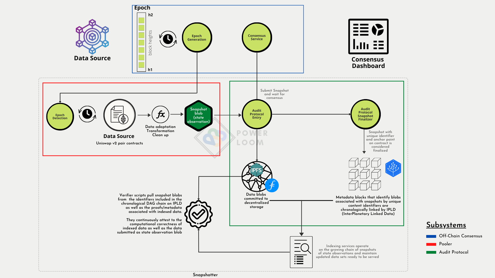

# Table of Contents
- [Table of Contents](#table-of-contents)
- [Overview](#overview)
- [Requirements](#requirements)
- [Setup Instructions](#setup-instructions)
  - [Docker Setup](#steps-using-docker)
  - [Run locally](#steps-to-run-directly)
  - [Setup Virtual Env](#setup-virtual-env)
  - [Configure Settings](#configure-settings)
- [Starting all Processes](#starting-all-processes)
- [Monitoring and Debugging](#monitoring-and-debugging)
- [Architecture Details](#architecture-details)

## Overview


Audit-Protocol is the component of a fully functional, distributed system that works alongside Pooler, off-chain consensus and together they are responsible for
* generating a time series database of changes occurring over smart contract state data and event logs, that live on decentralized storage protocols
* higher order aggregated information calculated over decentralized indexes maintained atop the database mentioned above

Audit-protocol can also be used for storing stream of json encoded data from any on-chain source(like a smart contract on a blockchain).
It has the following functions:

1. [Store snapshots](https://www.notion.so/powerloom/PowerLoom-Protocol-Overview-c3bf9dd9323541118d46a4d8684565d1?pvs=4#68d50c3a7db14f2893706e805f083bec) on decentralized storage protocols like IPFS and Filecoin.
2. Commit [anchor-proof](https://www.notion.so/powerloom/PowerLoom-Protocol-Overview-c3bf9dd9323541118d46a4d8684565d1?pvs=4#56c5333fa16940e8b0437e4d03129700) of snapshot on-chain
2. Submit snapshots for [consensus](https://github.com/PowerLoom/product/issues/10)
3. Track the [snapshot finalization](https://www.notion.so/powerloom/PowerLoom-Protocol-Overview-c3bf9dd9323541118d46a4d8684565d1?pvs=4#bf7a29dfd1384d28b45369b98d74a40f) and build a continuous DAG chain of snapshots
4. Provide API to access the [DAG chain](https://www.notion.so/powerloom/PowerLoom-Protocol-Overview-c3bf9dd9323541118d46a4d8684565d1?pvs=4#c008da3137294ad6b065cfe0fcc05032). of snapshots
5. Perform various high order operations such as time based indexing and aggregations on top of generated DAG chains

For a more detailed overview of the audit-protocol, please refer to the [protocol overview](https://powerloom.notion.site/PowerLoom-Protocol-Overview-c3bf9dd9323541118d46a4d8684565d1)

## Requirements
* macOS or Linux (We're still working on windows support)
* Python 3.8 or above and pip
* [Redis](https://redis.io/docs/getting-started/installation/)
* [RabbitMQ](https://www.rabbitmq.com/download.html)
* [Pm2](https://pm2.keymetrics.io/docs/usage/quick-start/)
* [IPFS](https://ipfs.tech/)

## Setup Instructions
There are 2 ways to run audit-protocol, using docker or running processes directly in your environment.
For simplicity it is recommended to run using docker.


### Steps using docker
* Install [Docker Desktop](https://www.docker.com/products/docker-desktop/)
* Follow the instructions below to setup virtual env and configure settings.
* Run services via docker as mentioned [here](https://github.com/PowerLoom/deploy/tree/main#instructions-for-code-contributors)


### Steps to run Directly
Note that these steps will only run audit-protocol. If you want to run the complete system, follow the steps mentioned in [Docker Setup](#steps-using-docker)
* Install required software as mentioned in [requirements](#requirements) section
* Follow instructions to [setup virtual env](#setup-virtual-env) and [configure settings](#configure-settings)
* Start all processes by running the command

```shell
pm2 start pm2.config.js
```

### Setup Virtual Env
* Setup a python virtual environment [Ref](https://docs.python.org/3/library/venv.html)

```shell
# pyenv install 3.8.13
# pyenv virtualenv 3.8.13 {venv-name}
# cd audit-protocol-private/
# pyenv local {venv-name}
```

* Install the required python packages:

```shell
pip install -r requirements.txt
```


###  Configure settings
* There is a **settings.example.json** file in the project folder. Navigate to the project and the type the following
command:

```shell
cp settings.example.json settings.json
```

- Create `settings.json` from `settings.example.json` template provided and populate it according to the following steps
    - Configure the provided `uuid` in `settings.instance_id`
    - Add your `rpc` details in `settings.rpc_url`
    - Configure the `pooler-namespace`
    - Configure consensus URL at `consensus_config.service_url`.
- *Optional Steps*
    - Increase rate-limit config `consensus_config.rate_limit` towards consensus based on number of pairs being snapshotted.
    - Configure `settings.dag_verifier.slack_notify_URL` if you want to receive alerts on slack channel. In order to setup slack workflow, refer steps [here](dag-verifier/README.md#configuring-slack-notifications).
- Copy over `static/cached_pair_addresses.json` from `pooler/static/cached_pair_addresses.json` .
* Note that by default many of these services uses default ports which are set
to 9000, 9002, 9030 and 8000 but if you already have some services running at that ports, you can
  change them to any other ports that are free in your system.

## Starting all Processes
To launch all the required processes, you can run
```commandline
pm2 start pm2.config.js
```

## Monitoring and Debugging

- To monitor the status of running processes, you simply need to run `pm2 status`.
- To see all logs you can run `pm2 logs`
- To see logs for a specific process you can run `pm2 logs <Process Identifier>`
- To see only error logs you can run `pm2 logs --err`
- You can monitor the status of all the projects such as if dag-chains are moving ahead etc with the following cli command.
```shell
python cli_cmd.py projectsstatus
```
## Usage

Audit protocol provides various endpoints which helps in users utilizing the basic functionality of :
* Registering [projects](https://www.notion.so/powerloom/PowerLoom-Protocol-Overview-c3bf9dd9323541118d46a4d8684565d1?pvs=4#501ebfda06ea4901a79ba211de0d8214) to be tracked
* Committing sequence of Snapshots pertaining to the project
* Query [DAG blocks](https://www.notion.so/powerloom/PowerLoom-Protocol-Overview-c3bf9dd9323541118d46a4d8684565d1?pvs=4#ef64620a4a6b4a45808f25a0556b9794) and payloads stored for the project

A high level user-interaction workflow is depicted in the diagram [ap-usage](docs/AuditProtocolUsage.png)

You can get more details about these endpoints in the [postman collection](../Powerloom%20New%20Architecture.postman_collection.json).


## Architecture Details
Details about working of various components is present in [Introduction](docs/Introduction.md) if you're interested to know more about audit-protocol.
