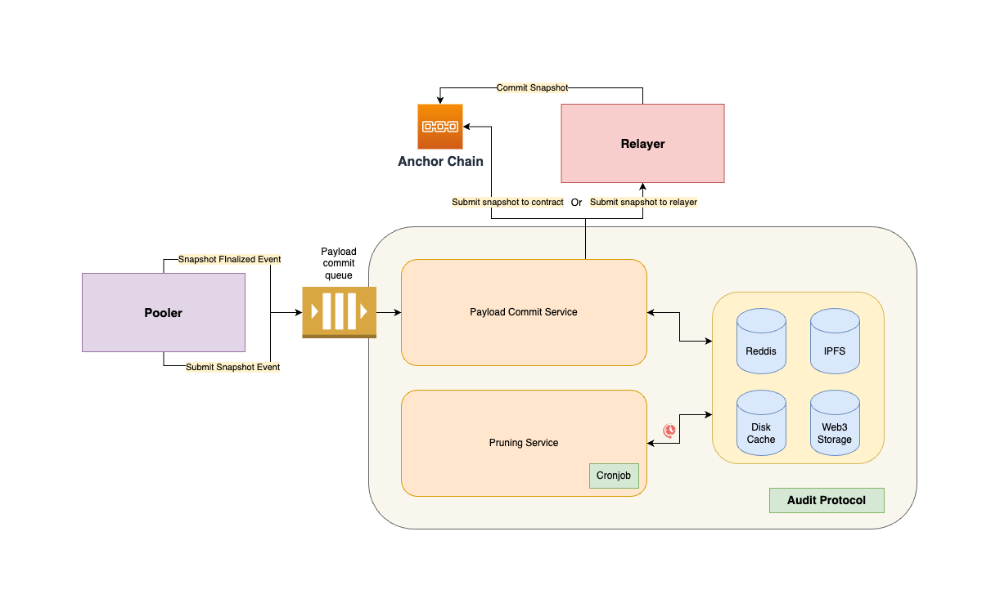
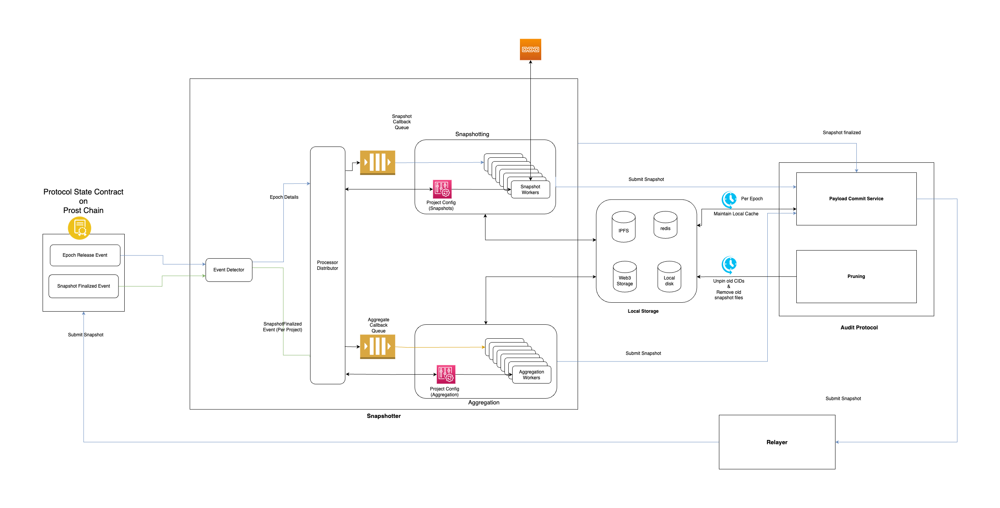

# Table of Contents
- [Table of Contents](#table-of-contents)
- [Overview](#overview)
  - [Role Of Audit Protocol](#role-of-audit-protocol)
  - [Project Architecture](#project-architecture)
    - [Payload Commit Service](#payload-commit-service-higher-level-flow)
    - [Pruning Service](#pruning-service-higher-level-flow)
- [Requirements](#requirements)
- [Setup Instructions](#setup-instructions)
  - [Configure Settings](#configure-settings)
  - [Docker Setup](#steps-for-docker-setup)
  - [Run locally](#steps-to-run-directly)
- [Monitoring and Debugging](#monitoring-and-debugging)
- [Alerting](#alerting)
- [Protocol Overview](#protocol-overview)
- [Architecture Details](#architecture-details)

## Overview


Audit Protocol is the component of a fully functional, distributed system that works alongside [Pooler](https://github.com/PowerLoom/pooler) and [Epoch Generator](https://github.com/PowerLoom/pooler/blob/dockerify/README.md#epoch-generation) together they are all responsible for
- Generating [aggregated snapshots](https://github.com/PowerLoom/pooler/tree/onchain_pooler#base-snapshot-generation) of [UniswapV2](https://v2.info.uniswap.org/home) specific data event logs over smart contract state transitions
- Communicating with other Snapshotter peers to reach consensus over smart contract, running over PowerLoom Protocol Testnet
- Ultimately provide access to rich [aggregates](https://github.com/PowerLoom/pooler/tree/onchain_pooler#aggregation-and-data-composition---snapshot-generation-of-higher-order-datapoints-on-base-snapshots) that can power a Uniswap V2 dashboard with the following data points:
  - Total Value Locked (TVL)
  - Trade Volume, Liquidity reserves, Fees earned
  - Transactions containing `Swap`, `Mint`, and `Burn` events

### Role Of Audit Protocol:
Audit Protocol provides following important functionalities:
- Submit snapshots generated by `Pooler` to the smart contract. Snapshots submitted by other snapshotter peers reach to consensus over the smart contract.
- Keeping cache of finalized snapshot data on local disk and IPFS (local/3rd party service) in most optimal way to reduce storage load.
  - Support for cronjob-based pruning of old snapshot data (using configured maximum duration) from local disk and IPFS.
  - Support for archival of snapshots to Web3Storage and ultimately backed to Filecoin (WIP)
- Generate snapshotter report for snapshot submissions and provide dashboard to view the report (WIP).

### Project Architecture

Audit protocol works on event based architecture using RabbitMQ. Events in this case are the messages sent to the message queue.
Audit Protocol listens to two types of messages described below:
1. `Commit Snapshot Message`: This message is sent by `Pooler` to Audit Protocol when a snapshot is generated for a [project](https://github.com/PowerLoom/pooler/tree/onchain_pooler#extending-pooler-with-a-uniswap-v2-data-point) for an [epochID](https://github.com/PowerLoom/pooler/tree/onchain_pooler#epoch-generation) over smart contract state transitions.
2. `Snapshot Finalized Message`: This message is sent by `Pooler` to Audit Protocol when a snapshot is finalized by smart contract after reaching consensus over the snapshots submitted by snapshotter peers for a project.

#### Payload commit service higher level flow
RabbitMQ message wise flow as mentioned in [Project Architecture](#project-architecture) section:
<!-- TODO: add links to white paper for each of the functions below -->
1. `Snapshot Commit Message`:
   - Store snapshots on decentralized storage protocols like IPFS and/or Web3 Storage.
   - Submit snapshots to the smart contract for consensus.
2. `Snaptshot Finalized Message`:
   - Receives finalized snapshot.
   - Compare committed snapshot with finalized snapshot.
   - Generate snapshotter report for snapshot submissions accordingly.
   - Keep a local cache of finalized snapshots.

#### Pruning service higher level flow
- Create cronjob entry which runs periodically according to configured duration (default `0 0 * * *` = every day).
- Prune snapshots older than configured max duration (default 7 days) from local disk and IPFS.

For a deeper dive into Audit Protocol services, refer to [Introduction](docs/Introduction.md) doc.

## Requirements
* macOS or Linux (We're still working on Windows support)
* [Go 1.18](https://golang.org/doc/install) or above
* [Redis](https://redis.io/docs/getting-started/installation/)
* [RabbitMQ](https://www.rabbitmq.com/download.html)
* [Pm2](https://pm2.keymetrics.io/docs/usage/quick-start/)
* [IPFS](https://ipfs.tech/) (Optional), if you use 3rd party IPFS provider like [Pinata](https://pinata.cloud/) or [Infura](https://infura.io/)

## Setup Instructions
There are 2 ways to run Audit Protocol, using docker or running processes directly in your local environment.
For simplicity, it is recommended to run using docker.

###  Configure settings
* Copy `settings.example.json` present in root directory of the project to `settings.json` file, and populate it with the required values.

```shell
cp settings.example.json settings.json
```

- Configure the snapshotter account address (EVM compatible 0x...) in `settings.instance_id`.
  - `instance_id`: This is the unique public key for your node to participate in consensus. It is currently registered on approval of an application (refer [deploy](https://github.com/PowerLoom/deploy/tree/onchain_deploy) repo for more details on applying).
- Configure the `pooler-namespace`
  - `pooler-namespace`: It is the unique key used to identify your project namespace around which all consensus activity takes place.
- Configure `anchor_chain_rpc_url` in `settings.anchor_chain_rpc_url`
- If you are using 3rd party IPFS provider, add a valid URL in `settings.ipfs.url` and `settings.ipfs.reader_url`
  - Fill authentication keys for the provider in `settings.ipfs.writer_auth_config` and `settings.ipfs.reader_auth_config`
- Configure Powerloom smart contract address in `settings.signer.domain.verifyingContract`
- Configure snapshotter account address and private key in `settings.signer.accountAddress` and `settings.signer.privateKey` respectively
- *Optional Steps*
  - Configure `settings.reporting.slack_webhook_url` if you want to receive alerts on the Slack channel.
    In order to set up a slack workflow, refer to [Slack workflow setup](./docs/slack_workflow_setup.md).
  - Configure access token for Web3 Storage in `settings.web3_storage.api_token`, if you want to use Web3 Storage to store snapshots.
* Note that by default `settings.healthcheck` service uses `9000` port, but if you already have some services running at that port, you can
  change to any other port that is free in your system.

### Steps for docker setup
* Install [Docker Desktop](https://www.docker.com/products/docker-desktop/)
* Run services via docker as mentioned [here](https://github.com/PowerLoom/deploy/tree/main#instructions-for-code-contributors)

### Steps to run directly
Note that these steps will only run Audit Protocol. If you want to run the complete system, follow the steps mentioned in [Docker Setup](#steps-for-docker-setup)
* Install required dependencies as mentioned in [requirements](#requirements) section
* Generate services binaries by running the following command

```shell
./build.sh
```

* Start all processes by running the following command

```shell
pm2 start pm2.config.js
```

## Monitoring and Debugging

- To monitor the status of running processes, you simply need to run `pm2 status`.
- To see all logs you can run `pm2 logs`
- To see logs for a specific process you can run `pm2 logs <Process Identifier>`
- To see only error logs you can run `pm2 logs --err`

*Note: if you are running docker setup, you can login into the container and run the above commands.*

## Alerting
Audit Protocol uses [Slack](https://slack.com/) for alerting. You can configure Slack alerts by referring to this [doc](./docs/slack_workflow_setup.md)
## Snapshotter reports

Audit protocol stores snapshotter reports in Redis and snapshots in the local cache directory specified in `settings.local_cache_path`.
- To get Snapshotter report for a particular project, you can run the following command
```bash
# login into redis-cli

# replace `<project_id>` with actual project id
HGETALL projectID:<project_id>:snapshotterStatusReport

# get successful snapshot submissions count for a project
GET projectID:<project_id>:totalSuccessfulSnapshotCount

# get missed snapshot submissions count for a project
GET projectID:<project_id>stg:totalMissedSnapshotCount

# get incorrect snapshot submissions count for a project
GET projectID:<project_id>:totalIncorrectSnapshotCount
```

***We are working on a dashboard to view Snapshotter reports. It will be available soon.***

## Protocol Overview


For the details of each component, refer to [component details](https://github.com/PowerLoom/pooler/blob/dockerify/README.md#major-components).

## Architecture Details
Details about the working of various components of Audit Protocol are present in [Introduction](docs/Introduction.md)
if you're interested to know more about Audit Protocol.
