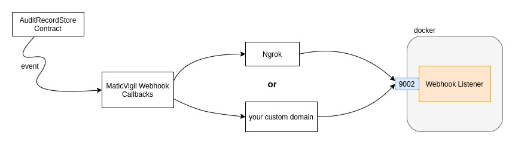

# Powerloom-protocol

Audit data by snapshotting payloads. Keep track of changes for each successive payload committed. 
Proof for the state for each payload at a particular time is represented by the transaction hash 
generated by committing the payload Cid to a smart contract. Each payload Cid is also wrapped up 
in a DAG structure, and each DAG structure houses the cid of the previous DAG, along with the
transaction hash for the payload and timestamp at which that payload was committed.

## Requirements
* Redis (This [link](https://redis.io/topics/quickstart) will guide you on installing redis-server on your machine)
* Python 3.6.5+ and pip

## Install Instructions
* This project makes use of [Maticvigil-Python-SDK](https://github.com/blockvigil/maticvigil-python-sdk), in-order
  to interact with smart contracts. You will need to setup a maticvigil account. Use this 
  [link](https://maticvigil.com/docs/web_onboarding) which lists step-by-step on how to create a new account and also
  deploy and interact with smart contracts. Once you've done creating your account, go to the settings tab in the WebUI
  and click on Export Account button. Save the settings.json to /home/\<user\>/.maticvigil folder on your local system. 
  
* Install mv-cli using this [guide](https://maticvigil.com/docs/cli_onboarding). Once installation is done, 
run the following commands:
  
  
```shell
mv-cli importsettings /home/<user>/.maticvigil/settings.json
mv-cli accountinfo
```

* Install the required python packages:

```shell
pip install -r requirements.txt
```
  
* Install IPFS Desktop. This [link](https://docs.ipfs.io/install/command-line/) will help you do that

## Deploy contract and add a Webhook

* Once you've successfully created your maticvigil account, then you need to deploy the contract **AuditRecordStore.sol** which
  can be found inside the project folder. You can deploy the contract through WebUI and a Webhook there itself.
  [Deploy Contract through WebUI](https://maticvigil.com/docs/web_onboarding#deploy-a-solidity-smart-contract).
  [Add Webhook integration to your contract](https://maticvigil.com/docs/web_onboarding/#webhooks)


* Every time a payload is up for snapshotting, the protocol will commit the Cid and other data of the payload to a smart contract.
An event is generated for this transaction which needs to be caught to confirm that the data has been committed successfully.
  The webhook_listener service is a server whose job is to listen to such events, and proceed with new block creation. You need
  a tunnel, or a server which can forward such events to your local system, so that they can reach the webhook listener.
  



  
## Configuring settings
* There is a **settings.example.json** file in the project folder. Navigate to the project and the type the following
command: 
  
```shell
cp settings.example.json settings.json
```

* Open up the settings.json file. There you need to edit two feilds:
  - contract_address: Add the contract address of the AuditContractStore contract that you deployed in the previous step
  - api_key: This field is present in /home/\<user\>/.maticvigil/settings.json file. Copy paste it here
  
* Other fields are ports for main webhook listener services. By default, they are set 
to 9000 and 9002, but if you already have some services running at that ports, you can 
  change them to any other ports that are free in your system.
  
## Running the services
* start the redis-server
* run the ipfs daemon
* make sure you webhook is up and running
* run all five services:

```shell
python gunicorn_main_launcher.py &
python gunicorn_webhook_launcher.py &
python payload_commit_service.py &
python pruning_service.py &
python retrieval_service.py &
```
* If you are using **filecoin** as a backup option (backup_targets field in settings.json), then you need to bring up 
[powergate](https://github.com/textileio/powergate). Make sure to turn off the local ipfs daemon since the powergate docker
  runs its own ipfs daemon which might cause port conflicts if that particular port is already occupied on your local system.
  Also you need to change the powergate_client_address in your **settings.json** to a different host if you are running 
  powergate on docker-machine on your mac
  
## Run through docker
* Alternatively, you can run the entire project through docker.
* Copy up the docker settings file

```shell
cp docker_settings.example.json docker_settings.json
```

* Make the necessary changes with **contract_address** and **api_key fields** in docker_settings.json.
* Bring up the docker:

```
./run_docker.sh 
```

* If you have chosen the backup option as filecoin, then run:
```shell
./run_docker.sh pg
```


## Usage
Try to commit some payload:
```shell
curl --location --request POST 'http://127.0.0.1:9000/commit_payload' \
--header 'Content-Type: text/plain' \
--data-raw '{
  "payload": {
      "test_field_a": "put any kind data here",
      "test_field_b": {
          "key_a": [1, 2],
          "key_b": 5000
      }
  },
  "projectId": "test_project_1"
}

```
The response you get should be:
```shell
{
    "cid": "QmQa7YZLitKkcMwRmZnx93wSEYjmtUxZgfdMJ1TQwSxgDa",
    "tentativeHeight": 1,
    "payloadChanged": true
}
```

There are 3 fields in the above response body:

- cid: This represents the content-identifier for the payload committed. It is a unique
hash for the payload field.
  
- tentativeHeight: Every new payload committed will have height that represents its position
in the chain of payloads committed. However tentativeHeight is not a deterministic value. If
  the proof for this payload is not recieved in the backend, the payload is discarded.
  
- payloadChanged: Represents whether the payload has changed from previous commit or not


There are endpoints which you can access to get dag blocks and retrieve the complete payload data:
- POST /commit_payload
- POST /{projectID}/diffRules
- GET /{prjectID}/getDiffRules
- GET /{projectID}/payloads/height
- GET /{projectID}/payload/{blockHeight}
- GET /{projectID}/payload/{blockHeight}/data
- GET /{projectID}/payloads
- GET /requests/{requestID}
- GET /projects/updates
- GET /{projectID}/payloads/cachedDiffs/count
- GET /{projectID}/payloads/cachedDiffs

You can more about these endpoints in [main_endpoints.md](docs/main_endpoints.md).
