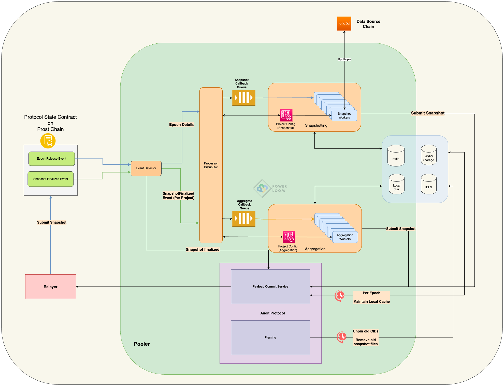
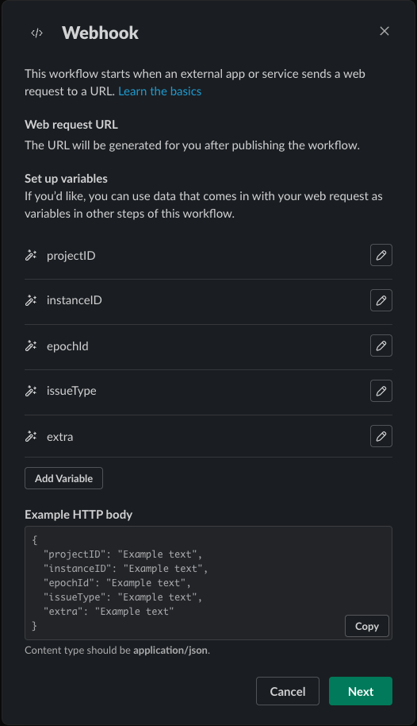
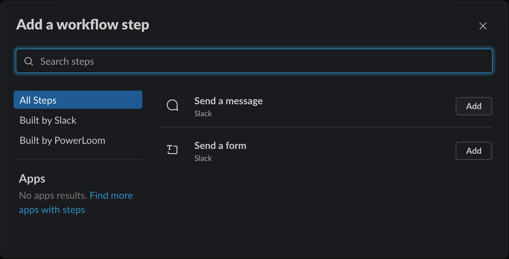
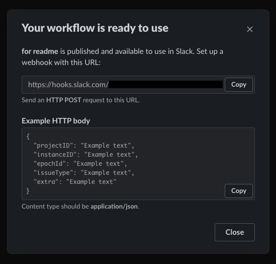

# Table of Contents
- [Table of Contents](#table-of-contents)
- [Overview](#overview)
- [Requirements](#requirements)
- [Setup Instructions](#setup-instructions)
  - [Configure Settings](#configure-settings)
  - [Docker Setup](#steps-using-docker)
  - [Run locally](#steps-to-run-directly)
- [Monitoring and Debugging](#monitoring-and-debugging)
- [Setting up Slack workflow](#setting-up-slack-workflow)
- [Architecture Details](#architecture-details)

## Overview

Architecture overview


Audit-Protocol is the component of a fully functional, distributed system that works alongside Pooler and Epoch Generator together they are all responsible for
* generating a time series database of changes occurring over smart contract state data and event logs, that live on decentralized storage protocols
* higher order aggregated information calculated over decentralized indexes maintained atop the database mentioned above

Audit-protocol is used for committing snapshots to on-chain source (like a smart contract on a blockchain) via transaction relayer or directly to it.
It has the following functions:

<!-- TODO: add links to while paper for each of the functions below -->
1. Store snapshots on decentralized storage protocols like IPFS and Filecoin.
2. Submit snapshots to the on-chain source for consensus.
3. Generate snapshotter report for snapshot submissions.
4. Keep a local cache of finalized snapshots.
5. Prune older snapshots.


## Requirements
* macOS or Linux (We're still working on Windows support)
* [Go 1.18](https://golang.org/doc/install) or above
* [Redis](https://redis.io/docs/getting-started/installation/)
* [RabbitMQ](https://www.rabbitmq.com/download.html)
* [Pm2](https://pm2.keymetrics.io/docs/usage/quick-start/)
* [IPFS](https://ipfs.tech/)

## Setup Instructions
There are 2 ways to run Audit-protocol, using docker or running processes directly in your local environment.
For simplicity, it is recommended to run using docker.

###  Configure settings
* Copy `settings.example.json` present in root directory of the project to `settings.json` file, and populate it with the required values.

```shell
cp settings.example.json settings.json
```

- Configure the snapshotter account address (EVM compatible 0x...) in `settings.instance_id`
- Configure the `pooler-namespace`
- Configure `anchor_chain_rpc_url` in `settings.anchor_chain_rpc_url`
- Configure the local cache directory path in `settings.local_cache_path`
- If you are using 3rd party IPFS provider, add a valid URL in `settings.ipfs.url` and `settings.ipfs.reader_url`
  - Fill authentication keys for the provider in `settings.ipfs.writer_auth_config` and `settings.ipfs.reader_auth_config`
- Configure access token for Web3 Storage in `settings.web3_storage.api_token`
- Configure Powerloom smart contract address in `settings.signer.domain.verifyingContract`
- Configure snapshotter account address and private key in `settings.signer.accountAddress` and `settings.signer.privateKey` respectively
- *Optional Steps*
  - Configure `settings.reporting.slack_webhook_url` if you want to receive alerts on the Slack channel.
    In order to set up a slack workflow, refer to steps [here](#setting-up-slack-workflow).
* Note that by default `healthcheck` service uses `9000` port, but if you already have some services running at that port, you can
  change to any other port that is free in your system.

### Steps using docker
* Install [Docker Desktop](https://www.docker.com/products/docker-desktop/)
* Run services via docker as mentioned [here](https://github.com/PowerLoom/deploy/tree/main#instructions-for-code-contributors)

### Steps to run directly
Note that these steps will only run Audit-protocol. If you want to run the complete system, follow the steps mentioned in [Docker Setup](#steps-using-docker)
* Install required software as mentioned in [requirements](#requirements) section
* Generate services binaries by running the following command

```shell
./build.sh
```

* Start all processes by running the following command

```shell
pm2 start pm2.config.js
```

## Monitoring and Debugging

- To monitor the status of running processes, you simply need to run `pm2 status`.
- To see all logs you can run `pm2 logs`
- To see logs for a specific process you can run `pm2 logs <Process Identifier>`
- To see only error logs you can run `pm2 logs --err`

*Note: if you are running docker setup, you can login into the container and run the above commands.*

## Snapshotter reports

Audit protocol stores snapshotter reports in Redis and snapshots in the local cache directory specified in `settings.local_cache_path`.
- To get Snapshotter report for a particular project, you can run the following command
```bash
# login into redis-cli

# replace `<project_id>` with actual project id
HGETALL projectID:<project_id>:snapshotterStatusReport

# get successful snapshot submissions count for a project
GET projectID:<project_id>:totalSuccessfulSnapshotCount

# get missed snapshot submissions count for a project
GET projectID:<project_id>stg:totalMissedSnapshotCount

# get incorrect snapshot submissions count for a project
GET projectID:<project_id>:totalIncorrectSnapshotCount
```

***We are working on a dashboard to view Snapshotter reports. It will be available soon.***

## Setting up Slack workflow

Following are the steps to create a slack workflow that would enable receiving notifications on a Slack channel.

- Open Slack Workflow builder and create a new workflow. Give a name for your workflow.
- Select the Webhook option as a way to start the workflow. Refer screenshot below.


- Add the following variables that can later be used to form an easy-to-read message from the JSON notification that is received.
  Select datatype as `Text` for all variables. The following screenshot can be used as a reference.
  - projectID
  - instanceID
  - epochId
  - issueType
  - extra



- Click `Next` and select `Add` Step to define the action to be taken.
- Click `Add` against Send a message



- Specify the channel where the message has to be sent and enter the message along with variables which we just created to form an informative message. Click `Save`


- Click on Publish which would give a pop-up with successfully published (Refer below)



- Copy the webhook URL displayed and configure it in `settings.json` file at `settings.reporting.slack_webhook_url` key.

- Restart the `Payload-commit` service process (if already running) to receive notifications via Slack.
  - If you are running Audit-protocol using docker, you can run the following command to restart the service
  ```shell
  docker exec -it <audit-protocol-container-id> pm2 restart ap-payload-commit
  ```
  - If you are running Audit-protocol directly, you can run the following command to restart the service
  ```shell
  pm2 restart ap-payload-commit
  ```

## Architecture Details
Details about the working of various components are present in [Introduction](docs/Introduction.md)
if you're interested to know more about Audit-protocol.
