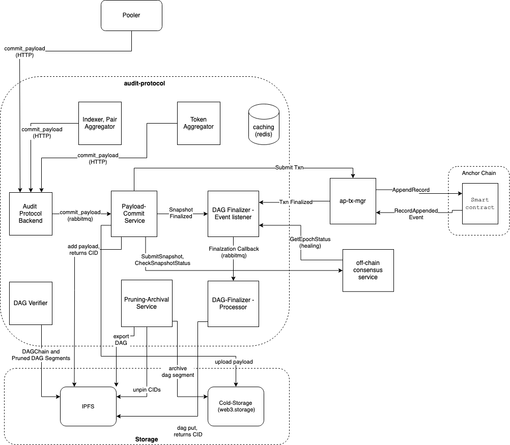
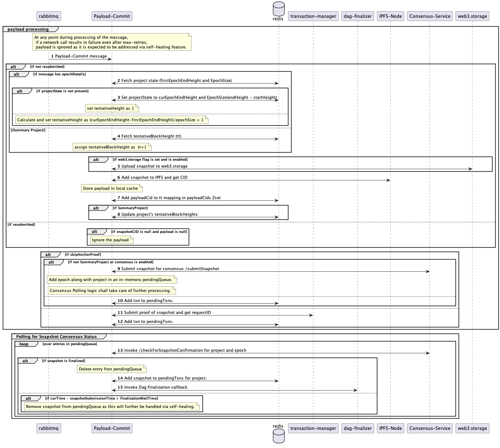
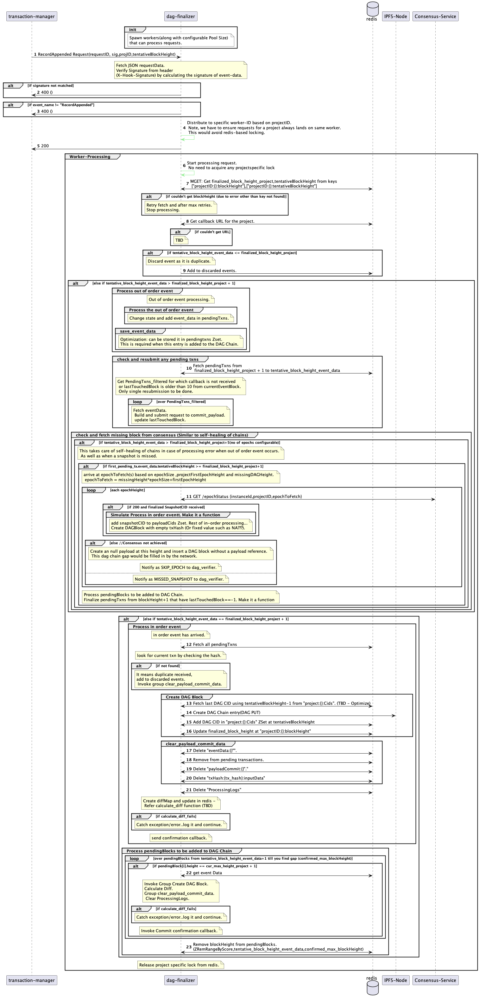
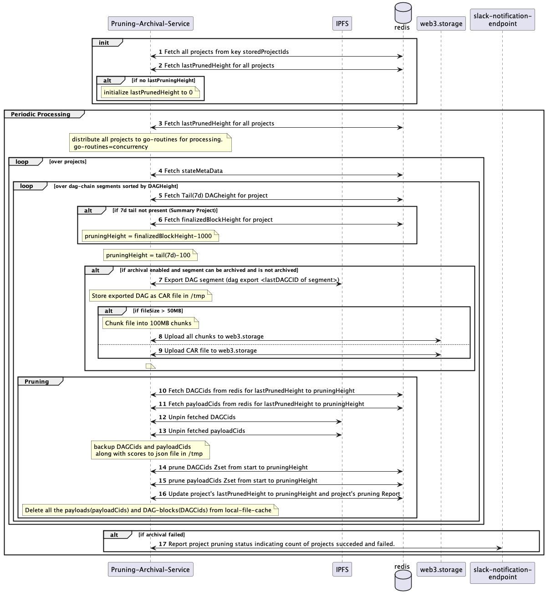
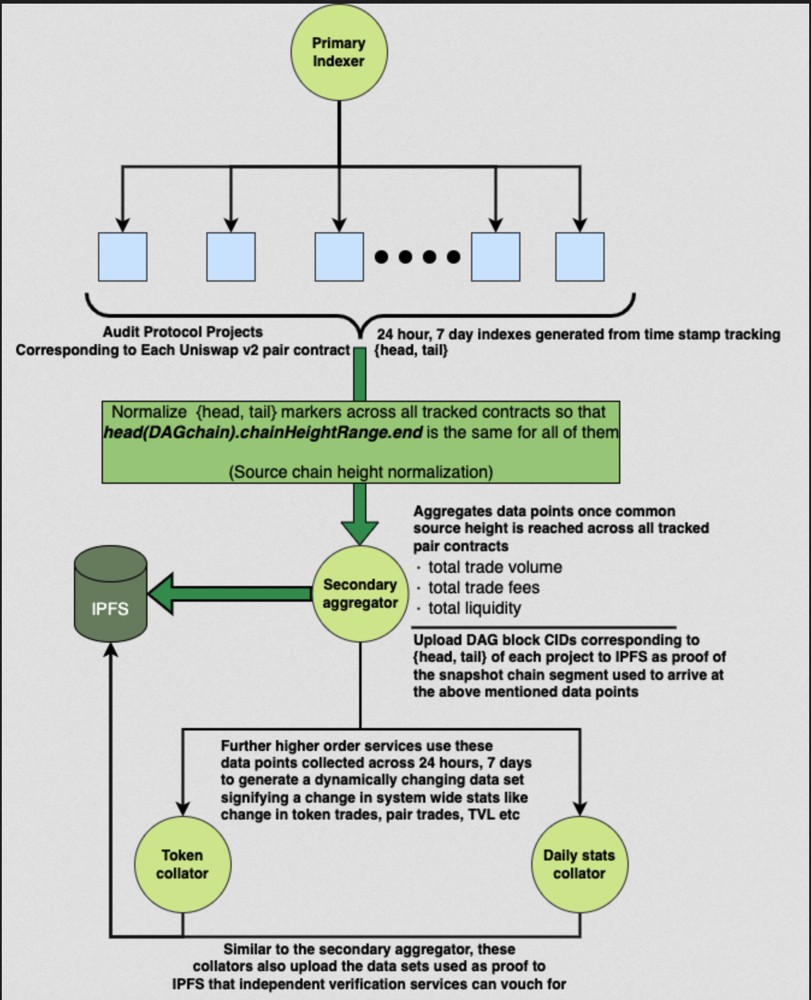
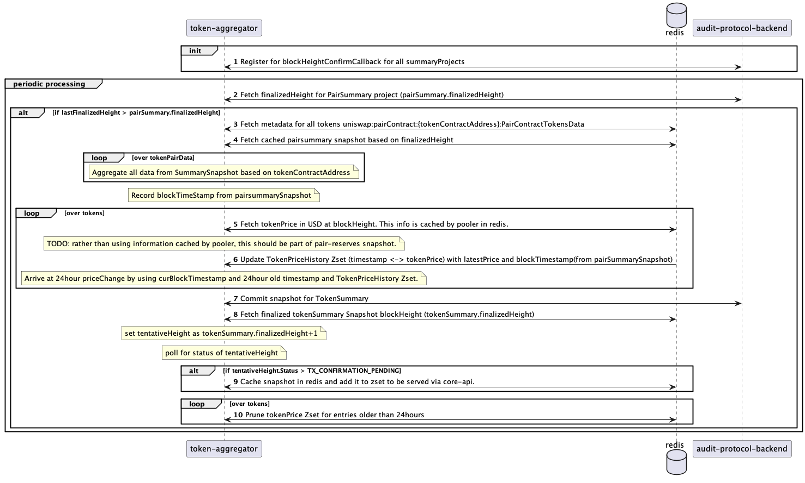

## Table of Contents
- [Introduction](#introduction)
- [Glossary](#glossary-of-key-terms)
- [Services](#services-details)
- [Code Structure](#code-structure)


# Audit Protocol

This document describes some of the concepts of the Audit protocol. It is highly recommended to use the dockerized
installation to run the project instead of manually running all the services.

## Introduction

The project mainly consists of 6 primary services and 2 supplementary services:
* [Backend](#backend)
* [Payload Commit](#payload-commit)
* [DAG Finalizer event-listener](dag-finalizer)
* [DAG Finalizer Processor](dag-finalizer)
* [Pruning Archival](#pruning-archival)
* [Dag Verifier](#dag-verifier)

The supplementary services are :
* [Indexer Aggregator](#indexer-aggregator)
* [Token Aggregator](#token-aggregator)

Here is a very high level-diagram of the audit-protocol components and their interactions:



## Glossary of Key Terms

### DAG Chain
  - [DAG](https://proto.school/merkle-dags) Chain is an immutable, decentralized and distributed data structure similar to a linked-list.
  - It is a list of DAG blocks stored as IPLD objects
  - Each DAG block is linked to the previous one via IPLD [links](https://ipld.io/docs/data-model/kinds/#link-kind)
  - A DAG Chain can be traversed only backwards from any DAG block by using IPLD links. Any additional kind of traversal would require indexes to be built.
  - A DAG block can be retrieved from any IPFS peer using its DAG-CID.
  - Modification of any block results in the rest of the chain being broken as the next block has a reference to the CID of the previous block.


### **DAG Block**

JSON Structure of a DAG Block

```json
{
    "data": {
        "cid": {
            "/": "bafkreicvx4547amf35oe5oci5jzomk2tky7a6uvmq3345sodo2djcibzfi"
        }
    },
    "height": 40,
    "prevCid": {
        "/": "bafyreigldjammrkx2jvu23bklxsspatqfheikukbwt2cta2bqu5j4nwlb4"
    },
    "timestamp": 1658406631,
    "txHash": "0x411d675990454b72de13189314083ba1cb9562d89d2ebb8334ec95f43963174c"
}
```

- `data.cid` is the CID of the snapshot-data stored on a decentralized storage like IPFS
- `height` indicates the height of the project(Refer below) at which the snapshot has been finalized
- `prevCid` is the CID of the last finalized DAG block for the project. `prevCid` of the first entry in the chain is going to be `null`
- `txHash` is the transaction Hash on the anchor chain acting as a proof of snapshot

Within a DAG block, the snapshot contained includes information on the epoch on which state observations were performed.
The `timestamp` field in a DAG block is the block timestamp of the latest block in that same epoch.


### **Project**
  1. A project in audit-protocol corresponds to each pair contract’s (like UNISWAPV2) DAG chain.
  2. Each snapshot is specific to a project
  3. Project has a tentativeheight and finalizedHeight. These heights are used to arrive at the order
  in which snapshots are to be finalized (one of the most common ways to achieve ordering in a distributed system).
  4. TentativeHeight is assigned tentatively for a snapshot until it is validated, stored and anchored onto the chain.
  5. Finalized Height is the height at which the finalized snapshot along with proof is added as a DAG Block onto the DAG Chain.


### tentativeBlockHeight
This is only applicable for SummaryProjects (which are special projects that are not based on epochs)
- Every payload that is sent to **/commit_payload** will be assigned a tentativeBlockHeight.
- tentativeBlockHeight represents what the height of the DAG block will be once it is created and appended to the DAG chain.

# Services Details
## backend

This is the backend server that lets you interact with the core functionality through APIs.
It has following functionalities"
1. Expose REST API's for various functionalities such as registering projects, submitting snapshots and querying DAG chain data.
    - POST /registerProjects
    - POST /commit_payload
    - GET /{projectID}/payloads/height
    - GET /{projectID}/payload/{blockHeight}
    - GET /{projectID}/payload/{blockHeight}/data
    - GET /{projectID}/payloads
2. Registers projects locally and also with the off-chain consensus service for snapshotting.
3. Submit received snapshots to a rabbitmq exchange which is in-turn consumed by the payload-commit service.

The API details be found in the [postman collection](../Powerloom%20New%20Architecture.postman_collection.json)

Code for this service can be browsed by going through [main](../main.py)

## Payload Commit

The payload commit service has following high level functionalities:
1. Listens on rabbitmq and process submitted snapshots and order them based on project state and the sourceChainHeight if in the snapshot.
2. Store the snapshot on IPFS and/web3.storage(based on configuration)
3. If consensus is enabled (This is enabled by default)
    - Submit the snapshot for consensus and wait for confirmation by polling the consensus service
    - Once snapshot is considered as finalized then invoke the finalization callback which is processed by dag-finalizer
5. If anchor proof is enabled (This is optional and is used in case of Summary projects)
    - - For each payload that is committed in ***payload_commit_service***, an event is generated once the transaction goes through.
  It's called **RecordAppended** event and carries the following information: **snapshotCid**, **projectId**,
  **tentativeBlockHeight**, **payloadCommitId**, **apiKeyHash**, and **timestamp**.
    -  proof of snapshot is submitted to txMgr and requestID along with other details of the snapshot is added to pending-queue
    - txMgr would inovoke the finalization callback which is processed by dag-finalizer

**Call Flow for payload-commit service**



Code for this service is located at [payload-commit](../payload-commit/)

## DAG finalizer

This consists of 2 services dag-finalizer-event-listener and dag-finalizer-processor.

The event-listener service listens for finalization callbacks and pushes them into a rabbitmq for processing.


The processor does most of the heavy lifting involved in the finalization of dag-blocks.
High level functionalities of the processor:
- Listens and [orders](https://www.notion.so/powerloom/PowerLoom-Protocol-Overview-c3bf9dd9323541118d46a4d8684565d1?pvs=4#bf7a29dfd1384d28b45369b98d74a40f)
the received events in order to ensure DAG chain gets created based on the tentativeBlockHeight.
- Segments the dag-chain to configured height so that we don't end up having infinitely long chains.
- Performs self-healing in case chain is stuck by querying the data required from the consensus service
    - In case the snapshot has not reached consensus, creates a DAG block with an empty payload so that chain doesn't get stuck

**Call-flow of dag-finalizer service**



## DAG Verifier

The function of DAG verifier service is to verify the continuity of DAG chains and identify gaps and report them.
More detailed functionality is explained [here](../dag-verifier/README.md)

Code for this service is located at [dag-verifier](../dag-verifier/dag_verifier.go)
and [pruning-verifier](../dag-verifier/pruning_verifier.go)


## Pruning Archival

In order to prune the state stored on IPFS and redis (cache),
the pruning service takes care of archiving old data and unpin it from local IPFS along with
pruning the project state maintained in redis cache.
Refer to [94](https://github.com/PowerLoom/audit-protocol-private/issues/94) for a high level overview of the pruning and archival service

**Call-flow of  pruning-archival service**



Code for this service is located at [pruning-archival](../pruning-archival)

## Indexer Aggregator

This process periodically runs every 90 seconds and performs the following:
1. Check if pairSummaryProjects have moved ahead since last run and if so, generate time-based indexes registered for the project i.e 24h and 7d.
It also inturn normalizes the sourceChainHeights for all projects in order to arrive at a common height.
Refer [Time Series Indexing](https://www.notion.so/powerloom/PowerLoom-Protocol-Overview-c3bf9dd9323541118d46a4d8684565d1?pvs=4#9adf8d9da1b14a1c8e16a09004c69e04) for details.
2. Trigger an aggregation routine which aggregates PairSummary data for each pair and then generates a PairSummarySnapshot.
This is what is served to the uniswap dashboard.
Refer [Pair Aggregation](https://www.notion.so/powerloom/PowerLoom-Protocol-Overview-c3bf9dd9323541118d46a4d8684565d1?pvs=4#3be67382f78e4d7ab934e96df43cba5a) for more details.
3. Trigger an aggregation routine which generates the dailyStats snapshot based on PairSummarySnapshot.
Refer [Daily Stats Aggregation](https://www.notion.so/powerloom/PowerLoom-Protocol-Overview-c3bf9dd9323541118d46a4d8684565d1?pvs=4#7e2a7e3f7c0c4739ad9ee2e715bfd2e9) for more details.


**Overview of interaction between indexers and aggregators**



Code for this service is located at [indexer](../proto_sliding_window_cacher_service.py),
[pair-aggregator](../pair_data_aggregation_service.py) and
[daily-stats-aggregator](../v2_pairs_daily_stats_snapshotter.py)

## Token Aggregator

This process runs in the background periodically (every 5 minutes) and generates a new tokenSummary snapshot.
This tokenSummarySnapshot is used to render to uniswap type dashboard.
Refer [Protocol Overview](https://www.notion.so/powerloom/PowerLoom-Protocol-Overview-c3bf9dd9323541118d46a4d8684565d1?pvs=4#e87823f11a3a4be9a322caa52fd7ca71) for overview.

Following is the high level functionalty:
1. Fetch token specific data for all tokens in pairs that are being tracked.
2. Following token specific data is stored in redis at key "uniswap:tokenInfo:UNISWAPV2:<tokenSymbol>:cachedData"
    1. Name - Can be fetched from local cache or token contract
    2. symbol - Can be fetched from local cache or token contract
    3. liquidity- Calculated by collating the latest liquidity in all pair contracts in which the token is part of.
    4. Volume (24 hrs) - Calculated by collating volume for all pair contracts in which the token is part of for last 24 hours.
    5. Price - (fetched from redis)
3. Check if a new PairSummarySnapshot is generated since last run and aggregate tokenData and generate a new TokenSummarySnapshot.
Json Schema of the snapshot is :
{
    "Name":"HEX",
    "Symbol":"HEX",
    "Price": 0.112128,  //float64
    "Liquidity": 66734422.07655703, //float64
    "TradeVolume_24h": 0  //float64
}

Note: If the dag-chain structure changes, then code has to be modified to work with new structure.

**Call-flow of token-aggregator service**

 

Code for this service is located at [token-aggregator](../token-aggregator/)


## Code Structure

### Golang Code
Golang Code has been structured as below. Common utils that are used by multiple Golang services are available in [goutils](../goutils/).
 Below are list of utils that are in common folder.

- Logger - Logger initialization and setup code
- redisutils - Redis client initialization and common operations wrapper code
- settings - Parsing the settings and settings deaults
- filecache utils - Code to read and write to file cache
- slackutils - Code to interact with slack workflow
- datamodel - Data models used across services
- ipfsutils - IPFS client initialization and common functionality
- commonutils - Other miscellaneous utils

Following services are written in Golang

- DAG Verifier  Service
    [DAG Verifier Notifications](https://www.notion.so/DAG-Verifier-Notifications-771936189a0f427394ec9fff4c1e8ba9)
- Payload Commit Service
- Pruning and Archival Service https://github.com/PowerLoom/audit-protocol-private/issues/94
- token-aggregator service

### Python Code

TBD