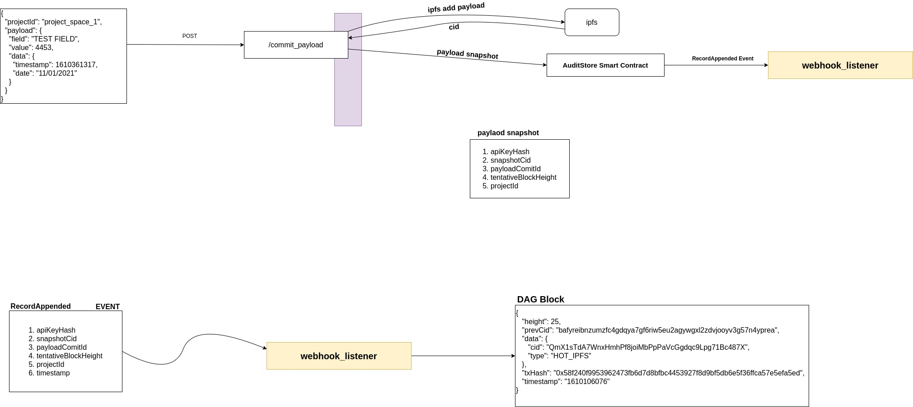
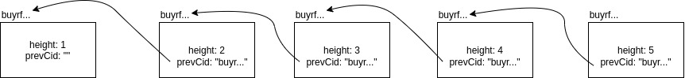

# Powerloom Protocol

This document describes some of the concepts of the Powerloom protocol. It is highly recommended to use the dockerized
installation to run the project instead of manually running all the services

## Introduction
The project mainly consists of 5 services:
* main
* webhook_listener
* payload_commit_service
* pruning_service
* retrieval_service

Here is a very high level-diagram of what the protocol does when a payload is committed: 



# main
main is the backend server that lets you interact with the core functionality through APIs. 
There are 11 endpoints in the main service

- POST /commit_payload
- POST /{projectID}/diffRules
- GET /{prjectID}/getDiffRules]
- GET /{projectID}/payloads/height
- GET /{projectID}/payload/{blockHeight}
- GET /{projectID}/payload/{blockHeight}/data
- GET /{projectID}/payloads
- GET /requests/{requestID}
- GET /projects/updates
- GET /{projectID}/payloads/cachedDiffs/count
- GET /{projectID}/payloads/cachedDiffs

The request and responses for each of these endpoints can be found in [main_endpoints.md](main_endpoints.md)

### explanation for some commonly used terms:

#### block height and prevCid

- Each DAG block will have a height field which represents its position in the dag chain.
- Each DAG block will have a prevCid field which has the cid of the previous block
- The first block has a height of 1 and its prevCid field will be empty
- This is the how the blocks are arranged:



#### tentativeBlockHeight

- Every payload that is sent to **/commit_payload** will be assigned a tentativeBlockHeight.
- tentativeBlockHeight represents what the height of the DAG block will be once it is created and appended to the DAG chain.

#### namespaces

- Each projects needs to have a namespace defining it.
- For example, take the projectId *project_new_19.* Here *project_new_* defines the namespace for this project. This way, you can set diffRules for an entire set of projects, if they carry the same namespace. Along with that, you can also get the snapshots of a batch of projectId's if they have the same namespace.

#### cid

- Each payload will have a unique cid associated with it. This cid represents the hash for that payload.
- Any change in the cid of the payload represents a change in the payload data itself.

#### dag blocks

- Each payload cid is put into a DAG structure along with metadata like timestamp and txHash.
- The structure of the DAG block looks like this:

    ```json
    {
    		"height":25,
    		"prevCid":"bafyreibnzumzfc4gdqya7gf6riw5eu2agywgxl2zdvjooyv3g57n4yprea",
    		"data": {
    				"cid":"QmeXAxrFAV2TZV8uDWRLWukGHwXgh7i5sCZGUEr1dqjd2X",
    				"type":"HOT_IPFS"
    			},
    		"txHash":"0x58f240f9953962473fb6d7d8bfbc4453927f8d9bf5db6e5f36ffca57e5efa5ed",
    		"timestamp":"1610106076"
    	}
    ```

- Once a payload is committed to audit-protocol through the **/commit_payload** endpoint, the payload cid, projectId, tentativeBlockHeight, and the timestamp are committed to a smart contract. 
  Once the transaction of the smart contract goes through, you get a transaction hash which acts as proof for the state of the payload at that point in time.

- In the above diagram, snapshotCid and cid are the same thing and can be used interchangeably. They represent the CID of the payload


# webhook_listener
- For each payload that is committed in ***payload_commit_service***, an event is generated once the transaction goes through. 
  It's called **RecordAppended** event and carries the following information: **snapshotCid**, **projectId**, 
  **tentativeBlockHeight**, **payloadCommitId**, **apiKeyHash**, and **timestamp**.
  
- The webhook_listener is another server that is listening for these events to come through and then creates a **DAG block** using the data from the event.
  
- Using the data in RecordAppended event, the webhook_listener creates a [DAG block that contains the information required to 
  verify the payload along with some metadata.
  
- The structure of the DAG block looks like this:

```json
    {
    		"height":25,
    		"prevCid":"bafyreibnzumzfc4gdqya7gf6riw5eu2agywgxl2zdvjooyv3g57n4yprea",
    		"data": {
    				"cid":"QmeXAxrFAV2TZV8uDWRLWukGHwXgh7i5sCZGUEr1dqjd2X",
    				"type":"HOT_IPFS"
    			},
    		"txHash":"0x58f240f9953962473fb6d7d8bfbc4453927f8d9bf5db6e5f36ffca57e5efa5ed",
    		"timestamp":"1610106076"
    	}
```

- However not all events will be made into a DAG block immediately upon arrival at the webhook_listener. 
  Only events that come in order(events with tentativeBlockHeight = 1 + blockHeight of the projectId) will be made into a DAG block.
  
- For example say you have a project with projectId "project_1" with 4 blocks i.e, the block height  is 4. 
  Now when an event arrives at the webhook_listener for project_1, it will turned into a DAG block only if it has a tentativeBlockHeight of 5. 
  If an event with tentativeBlockHeight of 6 arrives before the event with the tentativeBlockHeight of 5, then the event will be cached. 
  Once the event with tentativeBlockHeight = 5 arrives, then its DAG block will be created along with the event with tentativeBlockHeight = 6. 
  This way, the linear structure of the DAG chain is ensured.
  
- However these events are not cached forever. There will be some event E1 which had failed to each the webhook_listener 
  and hence that event along with all other cached events, will be dropped and the tenatative_block_height will be reset 
  to E1.height - 1. The max pending events in settings.example.json defines the limit of when to drop all the pending 
  events and reset the tentative_block_height.
  
- At the moment diff_map is calculated between blocks which are coming in order. If a dag block comes out of order, 
  then its diff_map will not be calculated


