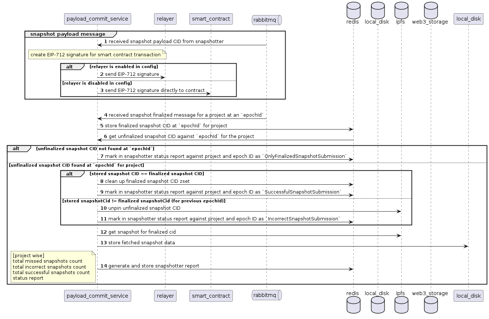

## Table of Contents
- [Introduction](#introduction)
- [Glossary](#glossary-of-key-terms)
- [Services](#services-details)
- [Code Structure](#code-structure)

# Audit Protocol

This document describes some of the concepts and details the services of the Audit protocol.
It is highly recommended to use the dockerized installation to run the project instead of manually running all the services.

## Introduction

The project consists of following services:
* [Payload Commit](#payload-commit)
* [Pruning Service](#pruning-service-ipfs-unpinning)

***high level-diagram of the audit-protocol components and their interactions:***

*Needs to be updated*

[//]: # (![audit-protocol-architecture]&#40;images/AuditProtocolArchitecture.png&#41;)

## Glossary of Key Terms

### **Project**
  1. A project in audit-protocol corresponds to each pair contract (like UNISWAPV2), trade_volume, etc.
  2. Each snapshot is specific to a project

### **EpochID**
  1. EpochID represents identifier for each generated epoch, stored on the smart contract.
  2. EpochID starts with 1 for the first epoch and increments by 1 for each epoch, when contract is deployed.
  3. Size of each epoch is configured on the smart contract.

## Services Details

### Payload Commit

The payload commit service has following high level functionalities:
1. Listens on rabbitmq snapshot generated events.
2. Store the snapshot on IPFS and/web3.storage (based on configuration).
    - stores cid from IPFS and web3.storage on redis cache for given project at provided epochID.
3. Creates EIP-712 based structured data hash and generates signature.
4. Submits the signature to the relayer (if configured) otherwise submits snapshot to smart contract.
5. Listens for snapshot finalization event on rabbitmq
   - if finalized snapshot for a given project against an epochId has same snapshotCID as stored on redis cache
     - store snapshot in local_disk cache 
   - if finalized snapshotCID is different, fetch finalized snapshot from IPFS and store in local disk cache
6. Generates snapshotter report

***Call Flow for payload-commit service***

Code for this service is located at [payload-commit](../go/payload-commit/)

### Pruning Service (IPFS unpinning)

The pruning service has the following high level functionalities:
- Runs as a cron job for every configured interval (default 7 days)
- Unpins IPFS cids of snapshots stored in local disk for more than configured value (default 7 days) 

***Call Flow for pruning service***

Code for this service is located at [pruning](../go/pruning/)
## Code Structure

### Golang Code
Golang Code is present in [go](../go/) folder and has been structured as below.
Common utils that are used by multiple Golang services are available in [goutils](../go/goutils/).
 Below are list of utils
- [caching](../go/caching) - Generic caching interface
- [logger](../go/goutils/logger/) - Logger initialization and setup code
- [redisutils](../go/goutils/redisutils/) - Redis client initialization and common operations wrapper code
- [settings](../go/goutils/settings/) - Parsing the settings and settings deaults
- [slackutils](../go/goutils/slackutils/) - Code to interact with slack workflow
- [datamodel](../go/goutils/datamodel/) - Data models used across services
- [ipfsutils](../go/goutils/ipfsutils/) - IPFS client initialization and common functionality
- [w3s](../go/goutils/w3s/) - Web3 storage client initialization and common functionality
- [health](../go/goutils/health/) - Health check listener
- [taskmgr](../go/goutils/taskmgr/) - Generic interface for task manager presently only has rabbitmq task manager
- [smartcontract](../go/goutils/smartcontract/) - Smart contract api
