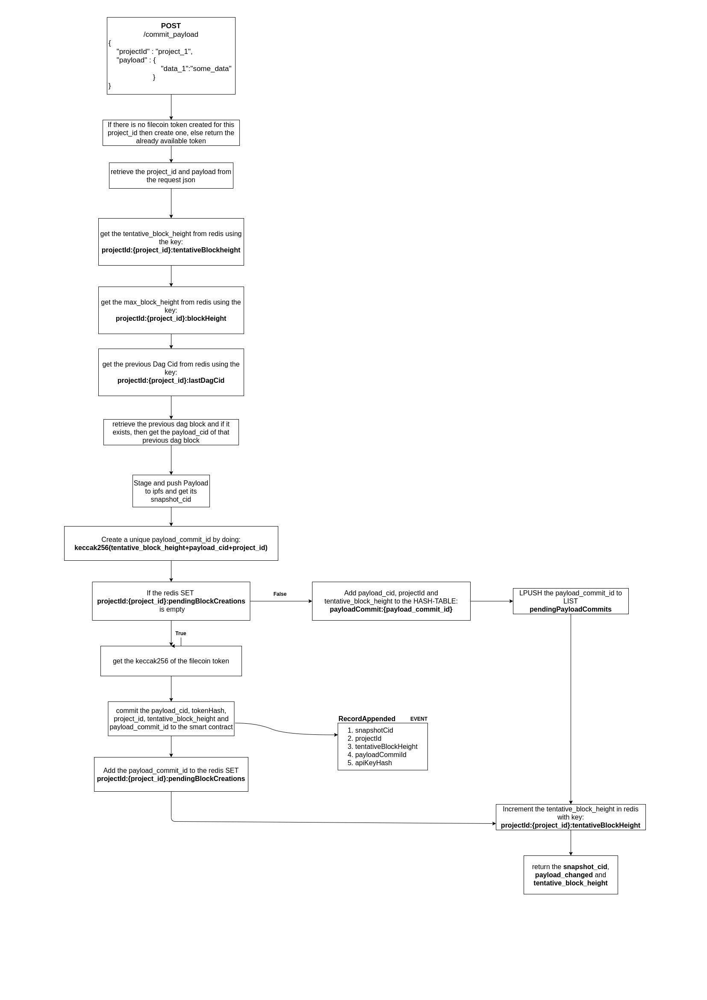

### POST /commit_payload



- The input of this endpoint is JSON data which should have two fields: projectId and payload. For example:

    ```json
    {
      "payload": {
        "data": "SomasdasdeData_3",
        "field": "CONSTANT FIELD"
      },
      "projectId": "project_a"
    }
    ```

- You can name the fields in *payload* however you want and it should be a JSON structure. Each field in the payload will be saved and would be checked for any kind of change in every next payload that is committed for the same *projectId*.
- Request:

```bash
curl --location --request POST 'http://localhost:9000/commit_payload' \
--header 'Content-Type: text/plain' \
--data-raw '{
  "payload": {
    "data": "SomasdasdeData_1",
    "field": "CONSTANT FIELD"
  },
  "projectId": "project_a"
}'
```

- Response:

```json
{
  "cid": "QmZDTxwr6xyrLXrrwL7h7YUvhdeZZ8HmMRtX39UxcQLrTM",
  "tentativeHeight": 1,
  "payloadChanged": false
}
```

### POST /{projectId}/diffRules

- Each projectId, can have its own set of rules that can be applied when calculating diff-maps between two successive payloads.
- For example, if you want to ignore a field called *timestamp* that is different for every payload, then you can specify rules to ignore that field.
- Take the below payload for reference.

```json
{
	"payload": {
			"field_a": "CONSTANT_DATA",
			"meta-data": {
                          "timestamp": 1610080118.643129
                      }
	},
	"projectId": "test_project_1"
}
```

- The rule to ignore the *timestamp* field will be:

```json
{
	"rules": [
		{
			"ruleType": "ignore",
			"field": "meta-data",
			"fieldType": "map",
			"ignoreMemberFields": ["timestamp"]
		}
	]
}
```

- Send this as a **POST** request to **/{projectId}/diffRules** endpoint and then the rules for the project_id will be configured.

```bash
curl --location --request POST 'http://localhost:9000/test_project_1/diffRules' \
--header 'Content-Type: text/plain' \
--data-raw '{
  "rules": [
    {
      "ruleType": "ignore",
      "field": "meta-data",
      "fieldType": "map",
      "ignoreMemberFields": [
        "timestamp"
      ]
    }
  ]
}'
```

### GET /{projectID}/getDiffRules

- Return the diffRules for that *projectID.*
- Request:

```bash
curl --location --request GET 'http://localhost:9000/test_project_1/getDiffRules'
```

- Response:

```json
[
    {
        "ruleType": "ignore",
        "field": "meta-data",
        "fieldType": "map",
        "ignoreMemberFields": [
            "timestamp"
        ]
    }
]
```

### GET /{projectID}/payloads/height

- Return the height]() of the latest [dag block that was created
- Request:

```shell
curl --location --request GET 'http://localhost:9000/project_a/payloads/height'
```

- Response:

```json
{
    "height": 29
}
```

### GET /{projectID}/payload/{blockHeight}

- Returns the block at that height if it is still pinned on the server otherwise will return a requestId
- Request:

```bash
curl --location --request GET 'http://localhost:9000/project_a/payload/2'
```

- Response:

```json
{
    "bafyreid5n6cdvladlhnmbmoi6rijlclyl7djmxtiltyvbmscx6f3oraqhi": {
        "data": {
            "cid": "QmRLPF2hSMfTAX1FBidYZ8sEJ3U42MeoRN7rhv9m7xrBVL",
            "type": "COLD_FILECOIN"
        },
        "height": 2,
        "prevCid": "bafyreig25lhuucjwioietwivkaebzmsvdjndxuwpgbd6uv2athdgxuryni",
        "timestamp": 1610090036,
        "txHash": "0x72de2b8c01c7eb8957efa5cb475491587e9e41f43a03c5eb60250d0fb010317d"
    }
}
```

### GET /{projectID}/payload/{blockHeight}/data

- This endpoint returns the payload data for the block at *blockHeight* for the project *projectID*
- Request:

```bash
curl --location --request GET 'http://localhost:9000/project_a/payload/2/data'
```

- Response:

```json
{
    "bafyreid5n6cdvladlhnmbmoi6rijlclyl7djmxtiltyvbmscx6f3oraqhi": {
        "cid": "QmRLPF2hSMfTAX1FBidYZ8sEJ3U42MeoRN7rhv9m7xrBVL",
        "type": "COLD_FILECOIN",
        "payload": "{\"data\": \"SomasdasdeData_2\", \"field\": \"CONSTANT FIELD\"}"
    }
}
```

### GET /{projectID}/payloads

- This endpoint facilitates retrieving a batch of payloads with a single GET request.
- **from_height** and **to_height** parameters specify the range of blocks that need to be retrieved
- the **data** query parameter is used to decide whether to include the *payload* along with the dag block]() or not. If the **data** parameter is not present or is set to false, then the *payload* field will not be added to the [dag block.
- Request:

```bash
curl --location --request GET 'http://localhost:9000/project_a/payloads?from_height=27&to_height=29&data=true'
```

- Response:

```json
[
    {
        "dagCid": "bafyreieyxciwmwvkr5awpptleidmcu22wvqkxvmxnlt267hbxiedlbtz3y",
        "data": {
            "cid": "QmSUV3br8EJkquqx9MXfZgdNXRweMyyCNFZL3siwfunC7A",
            "type": "COLD_FILECOIN",
            "payload": "{\"data\": \"SomasdasdeData_3\", \"field\": \"CONSTANT FIELD\"}"
        },
        "height": 29,
        "timestamp": "1610095084",
        "txHash": "0x6858140370d7165d6fb5ff49eea7d91456ef0aff26805a157a4af165bec9a7e4",
        "prevDagCid": "bafyreiaoh3hw6ja3rhyr6joyaauehrwg4sho7xyj25dwgpq5tbromea7zq",
        "payloadChanged": false
    },
    {
        "dagCid": "bafyreiaoh3hw6ja3rhyr6joyaauehrwg4sho7xyj25dwgpq5tbromea7zq",
        "data": {
            "cid": "QmSUV3br8EJkquqx9MXfZgdNXRweMyyCNFZL3siwfunC7A",
            "type": "COLD_FILECOIN",
            "payload": "{\"data\": \"SomasdasdeData_3\", \"field\": \"CONSTANT FIELD\"}"
        },
        "height": 28,
        "timestamp": "1610095084",
        "txHash": "0x25d2b47848d377da709853af146db77fb8e59266ebf5f2b7aa681e6ebb04c00a",
        "prevDagCid": "bafyreicjfw46522slofy27qbhakbhxngnqruvaw2dzv6mn2nm5oodryoda",
        "payloadChanged": false
    },
    {
        "dagCid": "bafyreicjfw46522slofy27qbhakbhxngnqruvaw2dzv6mn2nm5oodryoda",
        "data": {
            "cid": "QmSUV3br8EJkquqx9MXfZgdNXRweMyyCNFZL3siwfunC7A",
            "type": "COLD_FILECOIN",
            "payload": "{\"data\": \"SomasdasdeData_3\", \"field\": \"CONSTANT FIELD\"}"
        },
        "height": 27,
        "timestamp": "1610095082",
        "txHash": "0x9f06418005da67d71f2e8a96840018f907157c83fc0de0de3606d1a9ad492860",
        "prevDagCid": "bafyreie2le7w7dflhwyphwrrpdzhibnc5yxn4ln62zvozwpsh25qxzuq6y"
    }
]
```

- If the requested blocks are at a height beyond a certain range, then a requestId will be generated, which can be later used to fetch blocks after a certain period of time. This is because the retrieval process of data from filecoin is a slow process.
- Request:

```bash
curl --location --request GET 'http://localhost:9000/project_a/payloads?from_height=1&to_height=10&data=true'
```

- Response:

```json
{
    "requestId": "a50c263f-544d-4bc3-8bf6-1e9d7bf50fc4"
}
```

### **GET /requests/{requestID}**

- Return data retrieved for the *requestID.* If the request is still not completed then return the status of the request
- Request:

```bash
curl --location --request GET 'http://localhost:9000/requests/a50c263f-544d-4bc3-8bf6-1e9d7bf50fc4'
```

- Response:

```json
{
    "requestId": "a50c263f-544d-4bc3-8bf6-1e9d7bf50fc4",
    "requestStatus": "Completed",
    "files": [
        {
            "dagCid": "bafyreicsfo7pom2shqmkswsxits3wru7yp6lognazgsz4art23y2ymnswm",
            "payloadFile": "/static/bafyreicsfo7pom2shqmkswsxits3wru7yp6lognazgsz4art23y2ymnswm",
            "height": 1
        },
        {
            "dagCid": "bafyreig2icqtfx65cie7aqqrhcklzrssmjvrvhxyf6ovh4kql4kdgus47a",
            "payloadFile": "/static/bafyreig2icqtfx65cie7aqqrhcklzrssmjvrvhxyf6ovh4kql4kdgus47a",
            "height": 2
        },
        {
            "dagCid": "bafyreifaul43njudthbd62mvettlhfgoylu7porkg3qebtimc4qfq7e4ce",
            "payloadFile": "/static/bafyreifaul43njudthbd62mvettlhfgoylu7porkg3qebtimc4qfq7e4ce",
            "height": 3
        },
        {
            "dagCid": "bafyreifvgqeanfkni5ogwruzyvtlmjzo5hqikhp5qppanrdhodg4kjehsu",
            "payloadFile": "/static/bafyreifvgqeanfkni5ogwruzyvtlmjzo5hqikhp5qppanrdhodg4kjehsu",
            "height": 4
        },
        {
            "dagCid": "bafyreifsiidtmwqnt63hha6coz5utu2kva3iyxngdqcpqzljj5wvsfxa2i",
            "payloadFile": "/static/bafyreifsiidtmwqnt63hha6coz5utu2kva3iyxngdqcpqzljj5wvsfxa2i",
            "height": 5
        },
        {
            "dagCid": "bafyreibq4pkwwvkxtbxyo4m4k47n77xm3v5yfxxy66p6aqhlxuqrilooli",
            "payloadFile": "/static/bafyreibq4pkwwvkxtbxyo4m4k47n77xm3v5yfxxy66p6aqhlxuqrilooli",
            "height": 6
        },
        {
            "dagCid": "bafyreibtrg73zp4b6ee3znzma5dm4zsatx7oiyhdmi7uenxrglxudr2cpy",
            "payloadFile": "/static/bafyreibtrg73zp4b6ee3znzma5dm4zsatx7oiyhdmi7uenxrglxudr2cpy",
            "height": 7
        },
        {
            "dagCid": "bafyreiewjhpsiwph66k4gy433eqwrdynxp5a6lsulvvpm5zddtsvdqe3pq",
            "payloadFile": "/static/bafyreiewjhpsiwph66k4gy433eqwrdynxp5a6lsulvvpm5zddtsvdqe3pq",
            "height": 8
        },
        {
            "dagCid": "bafyreiappl5s4nqnzmpjzfb5z45cwkp4twuccreovoimgp4wqpomvrglgi",
            "payloadFile": "/static/bafyreiappl5s4nqnzmpjzfb5z45cwkp4twuccreovoimgp4wqpomvrglgi",
            "height": 9
        },
        {
            "dagCid": "bafyreiasny22nn32xb4soag5cpr62lvuekvuby5xxzicvqb7t7edy4sbva",
            "payloadFile": "/static/bafyreiasny22nn32xb4soag5cpr62lvuekvuby5xxzicvqb7t7edy4sbva",
            "height": 10
        }
    ]
}
```

- If the not complete yet, then the response will be:

```json
{
    "requestId": "e9f2baed-280c-4b1d-946f-e4f7049af504",
    "requestStatus": "Pending"
}
```

- Once the request is completed, you can send a GET request to the url in payloadFile field to retrieve the files.

```bash
curl --location --request GET 'http://localhost:9000/static/bafyreiasny22nn32xb4soag5cpr62lvuekvuby5xxzicvqb7t7edy4sbva'
```

```json
{"data": {"cid": "QmSUV3br8EJkquqx9MXfZgdNXRweMyyCNFZL3siwfunC7A", "type": "COLD_FILECOIN", "payload": "{\"data\": \"SomasdasdeData_3\", \"field\": \"CONSTANT FIELD\"}"}, "height": 10, "prevCid": "bafyreiappl5s4nqnzmpjzfb5z45cwkp4twuccreovoimgp4wqpomvrglgi", "timestamp": 1610095068, "txHash": "0x0848b3c7b5d492a468eef661ed5aa212ff8b010b4b700b5459d6f9a01420ddb7"}
```

### GET /projects/updates

- This endpoint returns diff snapshots for the given namespace in the sorted order of the timestamp of each diff snapshot.
- Request:

```bash
curl --location --request GET 'http://localhost:9000/projects/updates?namespace=project_'
```

- The response for this endpoint is:

```json
[
    {
        "projectId": "project_a",
        "diff_data": {
            "cur": {
                "height": 3,
                "payloadCid": "QmSUV3br8EJkquqx9MXfZgdNXRweMyyCNFZL3siwfunC7A",
                "dagCid": "bafyreifaul43njudthbd62mvettlhfgoylu7porkg3qebtimc4qfq7e4ce",
                "txHash": "0x6bfc46f4096a71e1ae9b9f519a68f67b0fd035a9ee8ee235c39d0330b87c3c94",
                "timestamp": 1610095044
            },
            "prev": {
                "height": 2,
                "payloadCid": "QmRLPF2hSMfTAX1FBidYZ8sEJ3U42MeoRN7rhv9m7xrBVL",
                "dagCid": "bafyreig2icqtfx65cie7aqqrhcklzrssmjvrvhxyf6ovh4kql4kdgus47a"
            },
            "diff": {
                "data": {
                    "old": "SomasdasdeData_2",
                    "new": "SomasdasdeData_3"
                }
            }
        }
    }
]
```

### GET /{projectID}/payload/cachedDiffs/count

- For the projectID, return the number of diff snapshots that have been cached on redis.
- Request:

```bash
curl http://localhost:9000/project_a/payloads/cachedDiffs/count
```

- Response:

```json
{
    "count": 2
}
```

### **GET /{projectID}/payload/cachedDiffs**

- For the projectID, return the cached diff snapshots if there are any.
- Request:

```bash
curl --location --request GET 'http://localhost:9000/project_a/payloads/cachedDiffs'
```

- Response:

```json
{
    "count": 2,
    "diffs": [
        {
            "cur": {
                "height": 3,
                "payloadCid": "QmSUV3br8EJkquqx9MXfZgdNXRweMyyCNFZL3siwfunC7A",
                "dagCid": "bafyreicvcqs2hx5zm62jro5zkerghnlotoiewxcqe2zpcvomdchivorwdy",
                "txHash": "0x15789ab393853c35dda8a8156cc0375fd91a1e87011ba40d0ff6c5f01e193733",
                "timestamp": 1610090234
            },
            "prev": {
                "height": 2,
                "payloadCid": "QmRLPF2hSMfTAX1FBidYZ8sEJ3U42MeoRN7rhv9m7xrBVL",
                "dagCid": "bafyreid5n6cdvladlhnmbmoi6rijlclyl7djmxtiltyvbmscx6f3oraqhi"
            },
            "diff": {
                "data": {
                    "old": "SomasdasdeData_2",
                    "new": "SomasdasdeData_3"
                }
            }
        },
        {
            "cur": {
                "height": 2,
                "payloadCid": "QmRLPF2hSMfTAX1FBidYZ8sEJ3U42MeoRN7rhv9m7xrBVL",
                "dagCid": "bafyreid5n6cdvladlhnmbmoi6rijlclyl7djmxtiltyvbmscx6f3oraqhi",
                "txHash": "0x72de2b8c01c7eb8957efa5cb475491587e9e41f43a03c5eb60250d0fb010317d",
                "timestamp": 1610090036
            },
            "prev": {
                "height": 1,
                "payloadCid": "QmZDTxwr6xyrLXrrwL7h7YUvhdeZZ8HmMRtX39UxcQLrTM",
                "dagCid": "bafyreig25lhuucjwioietwivkaebzmsvdjndxuwpgbd6uv2athdgxuryni"
            },
            "diff": {
                "data": {
                    "old": "SomasdasdeData_1",
                    "new": "SomasdasdeData_2"
                }
            }
        }
    ]
}
```

