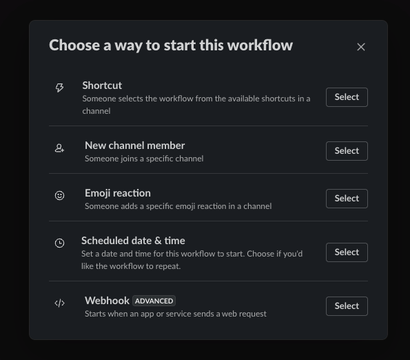
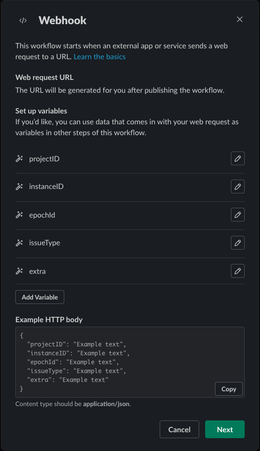
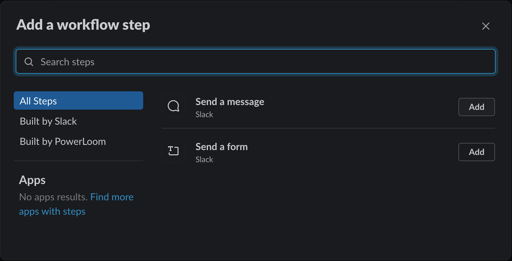
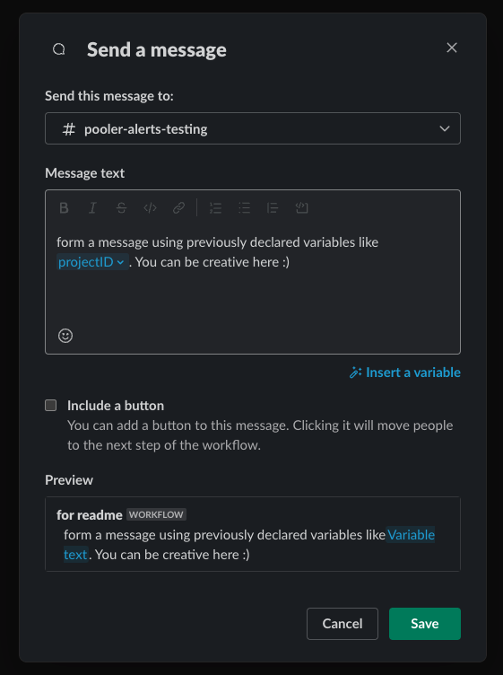
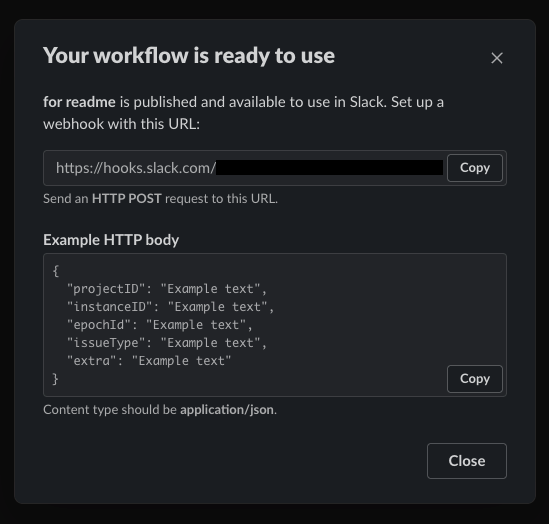

# Setting up Slack workflow

Following are the steps to create a slack workflow that would enable receiving alerts/notifications on a Slack channel.

- Open Slack Workflow builder and create a new workflow. Give a name for your workflow.
- Select the Webhook option as a way to start the workflow. Refer screenshot below.


- Add the following variables that can later be used to form an easy-to-read message from the JSON notification that is received.
  Select datatype as `Text` for all variables. The following screenshot can be used as a reference.
    - projectID
    - instanceID
    - epochId
    - issueType
    - extra



- Click `Next` and select `Add` Step to define the action to be taken.
- Click `Add` against Send a message



- Specify the channel where the message has to be sent and enter the message along with variables which we just created to form an informative message. Click `Save`



- Click on Publish which would give a pop-up with successfully published (Refer below)



- Copy the webhook URL displayed and configure it in `settings.json` file at `settings.reporting.slack_webhook_url` key.

- Restart the `Payload-commit` service process (if already running) to receive notifications via Slack.
    - If you are running Audit-protocol using docker, you can run the following command to restart the service
  ```shell
  docker exec -it <audit-protocol-container-id> pm2 restart ap-payload-commit
  ```
    - If you are running Audit-protocol directly, you can run the following command to restart the service
  ```shell
  pm2 restart ap-payload-commit
  ```
