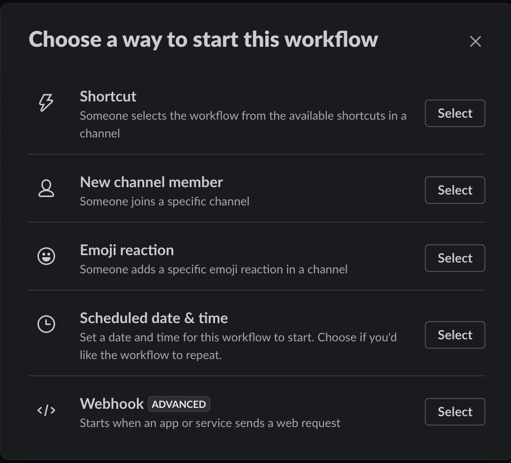
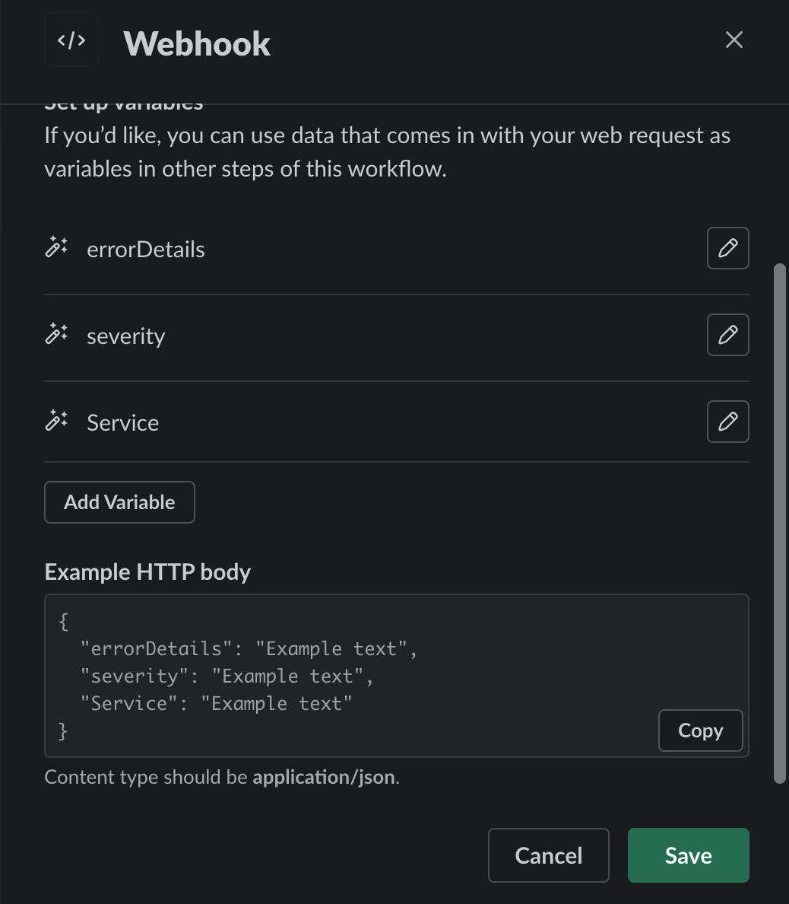
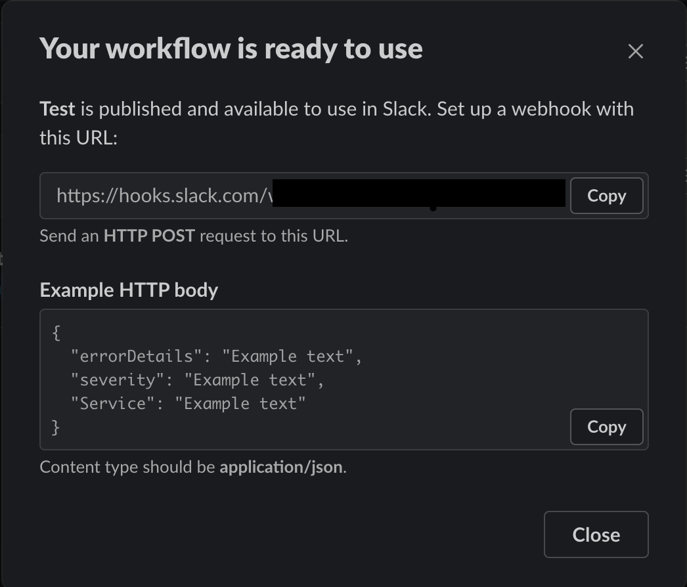

# Overview
DAG Status reporter service performs following functions:
1. Expose endpoint `/dagBlocksInserted` over http to receive callback from dag-finalizer service for newly added blocks.
```json
   {
    "projectID": "project_id_goes_here",
	"dagHeightCIDMap": {
           "bafyreic6x6ekvd3wc56vgol75nfygvav6pxj5raqvdghyqeyxmgcvmx6fy": 21
    }
   }
```

2. Check all possible issues in dag chain
   - Check for duplicate dag heights
   - Check for missing dag heights
   - Check for chain gaps
   - Check for null payloads
   - Check for gap in epochs
   - Check for missing epochs


3. Issue types
   - `BLOCKS_OUT_OF_ORDER` : When dag block heights are not in order
   - `EPOCH_SKIPPED` : When epoch is skipped
   - `PAYLOAD_MISSING` : When payload cid is null/missing
   - `DUPLICATE_DAG_BLOCK` : When duplicate dag block heights are found
   - `CID_HEIGHTS_OUT_OF_SYNC_IN_CACHE` : When Payload CID and Block CID heights are out of order
   - `CID_AND_PAYLOAD_CID_COUNT_MISMATCH` : When Payload CIDs and block CIDs count for a given range is not same
   - `MULTIPLE_BLOCKS_AT_SAME_HEIGHT` : When multiple blocks when different cid are at same block height
   - `INTERNAL_VERIFICATION_ERR` : Internal service issue. `CRITICAL` and should be addressed ASAP.
   - for information about json structure for all the issues, refer [here](./verifiers/dag_chain_verifier.go#L54-L92)

4. Issues are recorded in redis under every project as key `projectID:project:dagVerificationStatus`
5. Just run `main.go` to run the service
6. Verify the archival status of archived dag-segments.
7. Expose an endpoint to which issues are reported by other services [Ref](https://github.com/PowerLoom/audit-protocol-private/issues/143). These issues are :
    - Recorded in redis
    - Notified to consensus layer
    - Notified on slack if the URL is configured

In order to receive notifications, a slack workflow has to be setup and the webhook URL has to be configured in audit-protocol configuration. Steps to create and configure the workflow are defined [here](#configuring-slack-notifications).

[DAG Verification Call Flow](../../docs/images/DAGVerifier_CallFlow.png)
[Archival Verification Call Flow](../../docs/images/PruningVerifier_CallFlow.png)

# Configuring Settings
* Following section lists down all the settings along with defaults used by dag-verifier service.
```json
"dag_verifier": {
    "host": "0.0.0.0",
    "port": 9030,
    "slack_notify_URL": "",
    "notify_suppress_time_secs": 1800,
    "concurrency": 10,
    "ipfs_rate_limit": {
        "req_per_sec": 10,
        "burst": 10
    },
    "redis_pool_size": 20,
    "run_interval_secs": 300,
    "additional_projects_to_track_prefixes": [
        "uniswap_V2PairsSummarySnapshot",
        "uniswap_V2TokensSummarySnapshot",
        "uniswap_V2DailyStatsSnapshot"
    ],
    "pruning_verification": false
}
```

# Configuring Slack Notifications
Following are the steps to create a slack workflow that would enable receiving notifications on a slack channel.

- Open slack Workflow builder and create a new workflow. Give a name for your workflow.
- Select `Webhook` option as a way to start the workflow. Refer screenshot below.



- Add the below variables that can later be used to form a easier to read message from the json notification that is received. Select `datatype` as `Text` for all variables. Following screenshot can be used as reference.
    - `errorDetails`
    - `severity`
    - `Service`

    

- Click Save and select `Add Step` to define the action to be taken.
- Click `Add` against `Send a message`

    

- Specify the channel where the message has to be sent and enter the below message by inserting variables where-ever highlighted. Click `Save`

    `Service` reporting `Severity` alert with details `errorDetails`

- Click on `Publish`  which would give a pop-up with successfully published (Refer below)

    

- Copy the webhook URL displayed and configure it in your `audit-protocol settings.json` file under `dag_verifier` → `slack_notify_URL` .
- Restart the `dag_verifier` process (via pm2 restart `ap-dag-verifier`)  in order to receive notifications via slack.