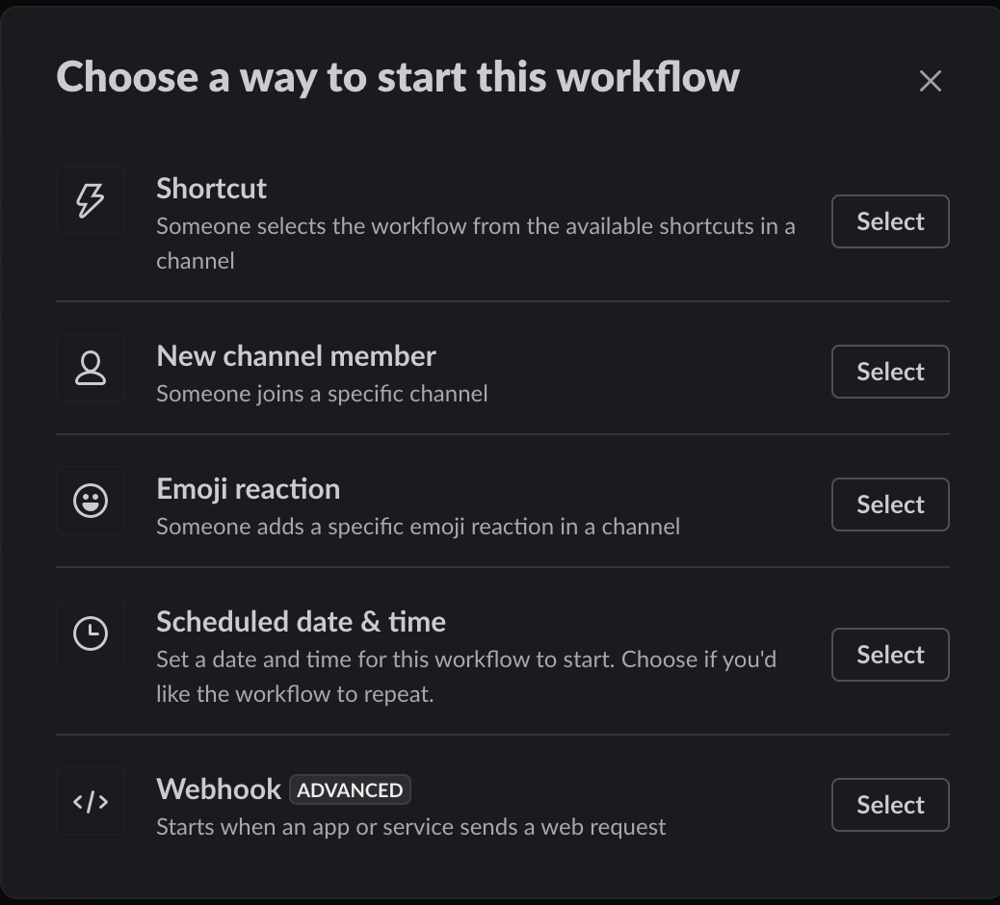
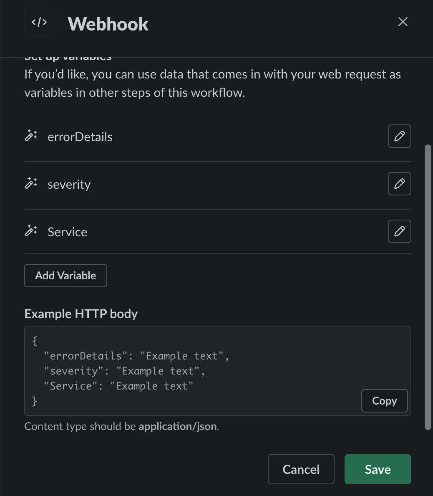
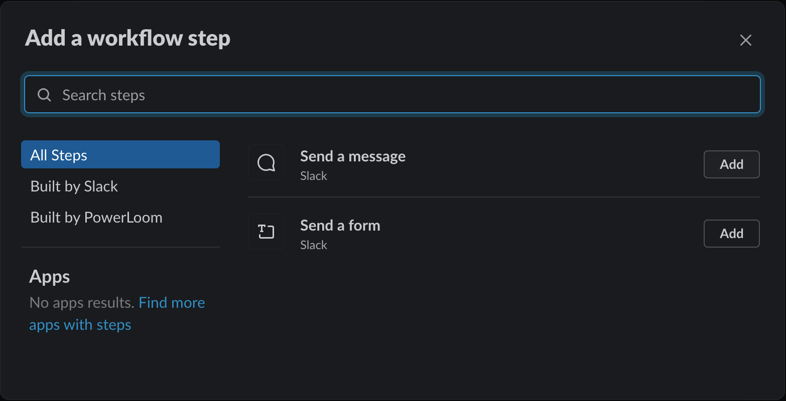
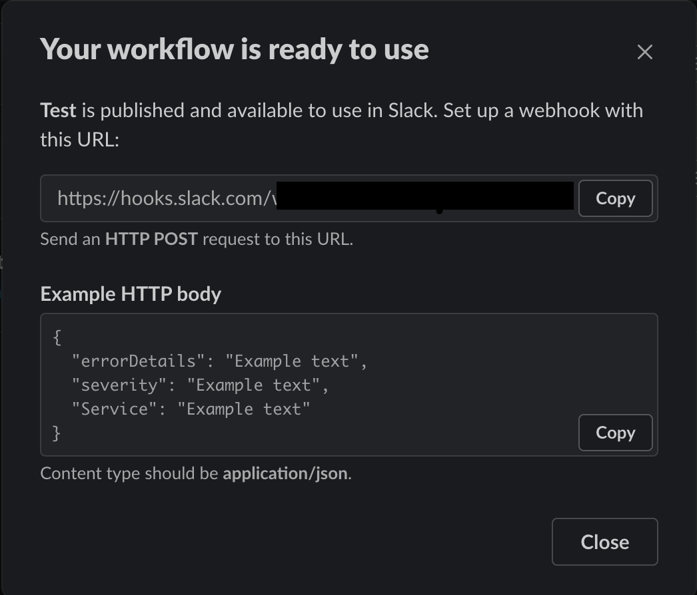

# Overview
DAG Verifier service performs following functions:
1. Periodically verify the status of project's DAG Chains to ensure that there are no gaps or issues in the chains. In case any issues are found, the same are recorded in redis as well as reported as slack notifications.
    Currently, dag verifier checks for following issues:
    - Gaps in DAG chains by looking at epochs at each snapshot and reports missing epochs
    - In case DAG chains are stuck due to any reason
2. Verify the archival status of archived dag-segments.
3. Expose an endpoint to which issues are reported by other services [Ref](https://github.com/PowerLoom/audit-protocol-private/issues/143). These issues are :
    - Recorded in redis
    - Notified to consensus layer
    - Notified on slack if the URL is configured

In order to receive notifications, a slack workflow has to be setup and the webhook URL has to be configured in audit-protocol configuration. Steps to create and configure the workflow are defined [here](#configuring-slack-notifications).

[DAG Verification Call Flow](../docs/DAGVerifier_CallFlow.png)
[Archival Verification Call Flow](../docs/PruningVerifier_CallFlow.png)

# Configuring Settings
* Following section lists down all the settings along with defaults used by dag-verifier service.
```json
"dag_verifier": {
    "host": "0.0.0.0",
    "port": 9030,
    "slack_notify_URL": "",
    "notify_suppress_time_secs": 1800,
    "concurrency": 10,
    "ipfs_rate_limit": {
        "req_per_sec": 10,
        "burst": 10
    },
    "redis_pool_size": 20,
    "run_interval_secs": 300,
    "additional_projects_to_track_prefixes": [
        "uniswap_V2PairsSummarySnapshot",
        "uniswap_V2TokensSummarySnapshot",
        "uniswap_V2DailyStatsSnapshot"
    ],
    "pruning_verification": false
}
```

# Configuring Slack Notifications
Following are the steps to create a slack workflow that would enable receiving notifications on a slack channel.

- Open slack Workflow builder and create a new workflow. Give a name for your workflow.
- Select `Webhook` option as a way to start the workflow. Refer screenshot below.



- Add the below variables that can later be used to form a easier to read message from the json notification that is received. Select `datatype` as `Text` for all variables. Following screenshot can be used as reference.
    - `errorDetails`
    - `severity`
    - `Service`

    

- Click Save and select `Add Step` to define the action to be taken.
- Click `Add` against `Send a message`

    

- Specify the channel where the message has to be sent and enter the below message by inserting variables where-ever highlighted. Click `Save`

    `Service` reporting `Severity` alert with details `errorDetails`

- Click on `Publish`  which would give a pop-up with successfully published (Refer below)

    

- Copy the webhook URL displayed and configure it in your `audit-protocol settings.json` file under `dag_verifier` → `slack_notify_URL` .
- Restart the `dag_verifier` process (via pm2 restart `ap-dag-verifier`)  in order to receive notifications via slack.